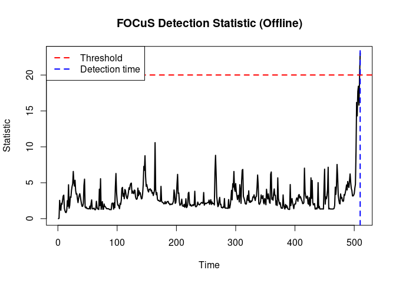
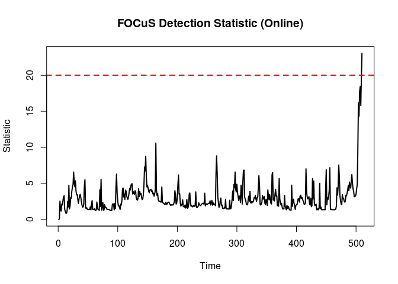
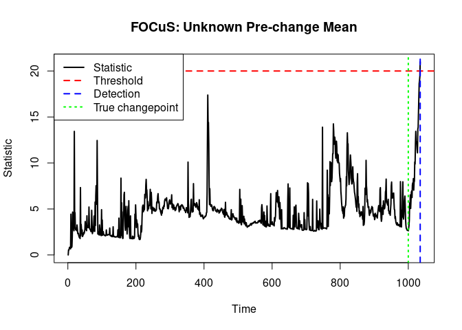
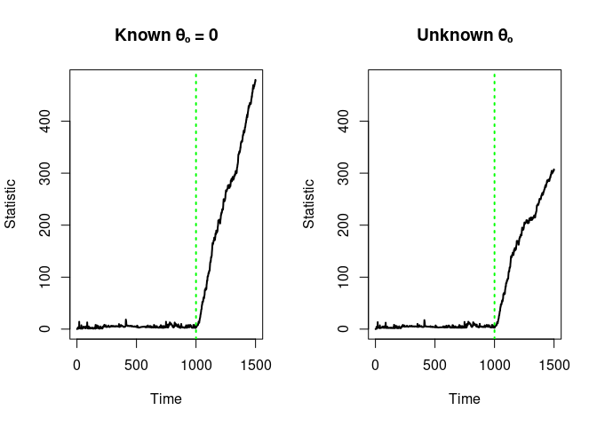
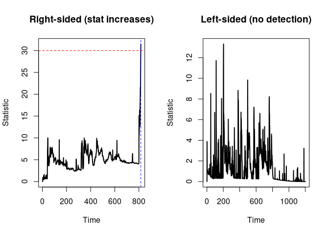
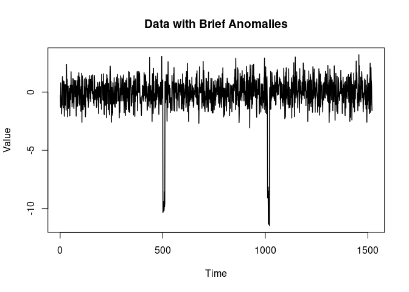
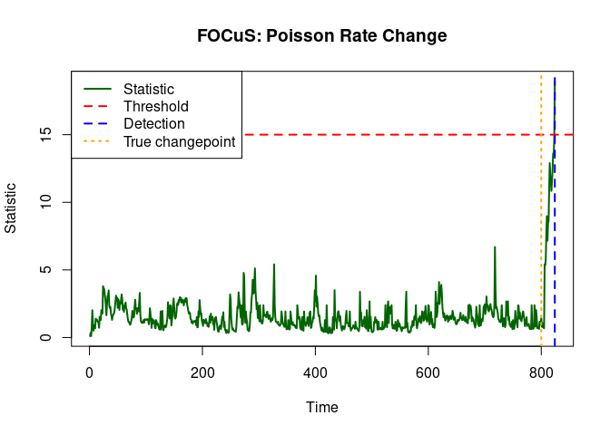
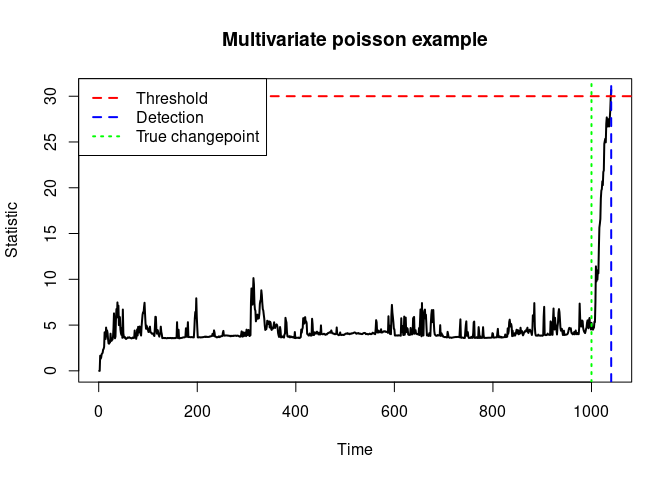
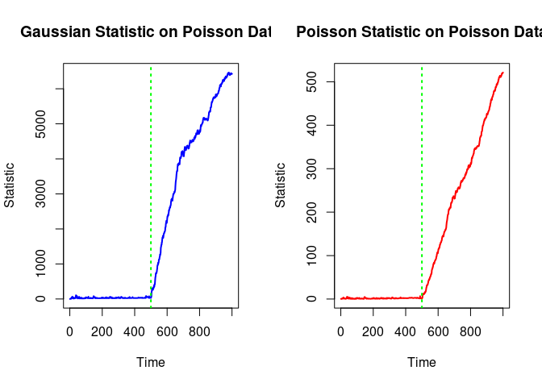

# focus


- [Features](#features)
- [Installation](#installation)
- [Quick Start: Offline vs Online
  Usage](#quick-start-offline-vs-online-usage)
  - [Offline Mode (`focus_offline`)](#offline-mode-focus_offline)
  - [Online Mode (Sequential Updates)](#online-mode-sequential-updates)
- [Available Functions](#available-functions)
  - [Core Detection Functions](#core-detection-functions)
  - [Online/Sequential Interface](#onlinesequential-interface)
  - [Inspection Functions](#inspection-functions)
- [Usage Examples](#usage-examples)
  - [Gaussian Univariate Detection](#gaussian-univariate-detection)
  - [One-sided Detection](#one-sided-detection)
  - [Gaussian Multivariate Detection](#gaussian-multivariate-detection)
  - [Poisson change-in-rate
    Detection](#poisson-change-in-rate-detection)
  - [Flexibility: Statistics Independent of Detector
    Type](#flexibility-statistics-independent-of-detector-type)
- [Performance Comparison: Offline vs
  Online](#performance-comparison-offline-vs-online)
- [C++ Integration](#c-integration)
- [References](#references)
- [License](#license)

**focus** is a high-performance R package for online changepoint
detection in univariate and multivariate data streams. The package
provides efficient C++ implementations of the **focus** and **md-focus**
algorithms with R interfaces for real-time monitoring and offline
analysis.

## Features

- **Multiple distributions**: Gaussian and Poisson families
- **Univariate and multivariate**: Detect changes in scalar or
  vector-valued sequences
- **One-sided and two-sided detection**: (Univariate only) Detects only
  increases, decreases, or both
- **Known or unknown pre-change parameters**: Flexible modeling of both
  the LR test (pre-change parameter unknown) and the Page-CUSUM
  (pre-change parameter known)
- **C++ backend**

## Installation

You can install the development version of **focus** from source with:

``` r
# If you have devtools installed:
devtools::install_github("gtromano/unified_focus", subdir = "focus")
```

Or, if you have the package source directory:

``` r
install.packages("path/to/focus", repos = NULL, type = "source")
```

## Quick Start: Offline vs Online Usage

The package provides two modes of operation with identical statistical
results but different performance characteristics:

### Offline Mode (`focus_offline`)

All cycles and updates are handled internally in C++ for maximum
efficiency. This approach is ideal for:

- Benchmarking and performance testing
- Batch processing of complete datasets
- Computing full statistic trajectories

**Key behaviors:**

- By default, stops immediately when threshold is exceeded
- Use `threshold = Inf` to compute statistics for all observations
  (useful for visualization)

``` r
# Generate data with a changepoint
set.seed(123)
Y <- c(rnorm(500, mean = 0), rnorm(500, mean = 2))

# Run offline detection (all processing in C++)
res <- focus_offline(Y, threshold = 20, type = "univariate", family = "gaussian")

# Plot results
plot(res$stat, type = "l", main = "FOCuS Detection Statistic (Offline)",
     xlab = "Time", ylab = "Statistic", lwd = 2)
abline(h = res$threshold, col = "red", lty = 2, lwd = 2)
if (!is.null(res$detection_time)) {
  abline(v = res$detection_time, col = "blue", lty = 2, lwd = 2)
  legend("topleft", 
         legend = c("Threshold", "Detection time"),
         col = c("red", "blue"), lty = 2, lwd = 2)
}
```



### Online Mode (Sequential Updates)

An **online implementation** is also available—allowing you to update
the detector sequentially from R. This will be inherently slower, since
each update involves a call from R into C++. The online interface is
useful for:

- Real-time or streaming scenarios
- Integration with other R workflows
- Custom stopping rules (adaptive thresholds)
- Implementation of your own costs function

``` r
# Create detector
det <- detector_create(type = "univariate")

# Update sequentially
stat_trace <- numeric(length(Y))
threshold <- 20

for (i in seq_along(Y)) {
  detector_update(det, Y[i])
  result <- get_statistics(det, family = "gaussian")
  stat_trace[i] <- result$stat
  
  if (result$stat > threshold) {
    cat("Detection at time", i, "with changepoint estimate τ =", result$changepoint, "\n")
    stat_trace <- stat_trace[1:i]  # Truncate
    break
  }
}
```

    Detection at time 510 with changepoint estimate τ = 500 

``` r
# Plot results
plot(stat_trace, type = "l", main = "FOCuS Detection Statistic (Online)",
     xlab = "Time", ylab = "Statistic", lwd = 2)
abline(h = threshold, col = "red", lty = 2, lwd = 2)
```



Both approaches produce the same statistical results. See the
performance comparison section below for runtime benchmarks.

## Available Functions

### Core Detection Functions

- **`focus_offline(Y, threshold, type, family, ...)`**  
  Run the FOCuS detector in batch/offline mode with all cycles handled
  in C++ for maximum efficiency. Stops at detection by default; use
  `threshold = Inf` to compute statistics for all observations.

### Online/Sequential Interface

- **`detector_create(type, theta0 = NULL, ...)`**  
  Create a new online detector object. Returns an Info object pointer.

  - `type`: One of `"univariate"`, `"univariate_one_sided"`, or
    `"multivariate"`
  - `theta0`: Optional null hypothesis parameter(s)

- **`detector_update(detector, y)`**  
  Update the detector with a new observation vector `y`.

- **`get_statistics(detector, family, theta0 = NULL)`**  
  Compute changepoint statistics for the current state.

  - `family`: `"gaussian"` or `"poisson"`
  - Returns a list with `stopping_time`, `changepoint`, and `stat`

### Inspection Functions

- **`detector_info_n(detector)`** - Get number of observations processed
- **`detector_info_sn(detector)`** - Get cumulative sum state
- **`detector_pieces_len(detector)`** - Get number of candidate
  changepoints
- **`detector_candidates(detector)`** - Get all candidate changepoints
  as a data frame

## Usage Examples

### Gaussian Univariate Detection

#### Pre-change Parameter Unknown

When the pre-change mean is unknown, FOCuS estimates it from the data:

``` r
# Generate data: 1000 obs at mean 0, then 500 obs at mean -1
set.seed(45)
Y <- c(rnorm(1000, mean = 0), rnorm(500, mean = -1))

# Offline detection (stops at detection)
res <- focus_offline(Y, threshold = 20, type = "univariate", family = "gaussian")

cat("Detection time:", res$detection_time, "\n")
```

    Detection time: 1035 

``` r
cat("Estimated changepoint:", res$detected_changepoint, "\n")
```

    Estimated changepoint: 991 

``` r
# Plot
plot(res$stat, type = "l", main = "FOCuS: Unknown Pre-change Mean",
     xlab = "Time", ylab = "Statistic", lwd = 2)
abline(h = res$threshold, col = "red", lty = 2, lwd = 2)
abline(v = res$detection_time, col = "blue", lty = 2, lwd = 2)
abline(v = 1000, col = "green", lty = 3, lwd = 2)
legend("topleft", 
       legend = c("Statistic", "Threshold", "Detection", "True changepoint"),
       col = c("black", "red", "blue", "green"), 
       lty = c(1, 2, 2, 3), lwd = 2)
```



#### Pre-change Parameter Known

When you know the pre-change mean, provide it via `theta0` (this will
give more power to detect changes more quickly!):

``` r
set.seed(45)
theta0 <- 0
Y <- c(rnorm(1000, mean = theta0), rnorm(500, mean = theta0 - 1))

# With known pre-change parameter
res_known <- focus_offline(Y, threshold = Inf, type = "univariate", 
                           family = "gaussian", theta0 = theta0)

# Compare with unknown case
res_unknown <- focus_offline(Y, threshold = Inf, type = "univariate", 
                             family = "gaussian")

# Plot comparison
par(mfrow = c(1, 2))
plot(res_known$stat, type = "l", main = "Known θ₀ = 0",
     xlab = "Time", ylab = "Statistic", lwd = 2, ylim = range(c(res_known$stat, res_unknown$stat)))
abline(v = 1000, col = "green", lty = 3, lwd = 2)

plot(res_unknown$stat, type = "l", main = "Unknown θ₀",
     xlab = "Time", ylab = "Statistic", lwd = 2, ylim = range(c(res_known$stat, res_unknown$stat)))
abline(v = 1000, col = "green", lty = 3, lwd = 2)
```



``` r
par(mfrow = c(1, 1))
```

### One-sided Detection

Detect only increases (right-sided) or decreases (left-sided):

``` r
set.seed(789)
Y_increase <- c(rnorm(800, mean = 0), rnorm(400, mean = 1.5))

# Right-sided: detect only increases
res_right <- focus_offline(Y_increase, threshold = 30, 
                           type = "univariate_one_sided", 
                           family = "gaussian", side = "right")

cat("Right-sided detection at:", res_right$detection_time, "\n")
```

    Right-sided detection at: 816 

``` r
# Left-sided: detect only decreases (won't detect in this data)
res_left <- focus_offline(Y_increase, threshold = 30, 
                          type = "univariate_one_sided", 
                          family = "gaussian", side = "left")

cat("Left-sided detection:", 
    ifelse(is.null(res_left$detection_time), "None", res_left$detection_time), "\n")
```

    Left-sided detection: None 

``` r
# Plot comparison
par(mfrow = c(1, 2))
plot(res_right$stat, type = "l", main = "Right-sided (stat increases)",
     xlab = "Time", ylab = "Statistic", lwd = 2)
abline(h = 30, col = "red", lty = 2)
if (!is.null(res_right$detection_time)) {
  abline(v = res_right$detection_time, col = "blue", lty = 2)
}

plot(res_left$stat, type = "l", main = "Left-sided (no detection)",
     xlab = "Time", ylab = "Statistic", lwd = 2)
abline(h = 30, col = "red", lty = 2)
```



``` r
par(mfrow = c(1, 1))
```

### Gaussian Multivariate Detection

For vector-valued observations:

``` r
set.seed(42)
n <- 1500
p <- 3

# Create data: changepoint at t=1000
Y_multi <- rbind(
  matrix(rnorm(1000 * p, mean = 0), ncol = p),
  matrix(rnorm(500 * p, mean = 1.2), ncol = p)
)

# Run detection
res_multi <- focus_offline(Y_multi, threshold = 30, 
                           type = "multivariate", family = "gaussian")

cat("Detection time:", res_multi$detection_time, "\n")
```

    Detection time: 1012 

``` r
cat("Estimated changepoint:", res_multi$detected_changepoint, "\n")
```

    Estimated changepoint: 1000 

``` r
cat("True changepoint: 1000\n")
```

    True changepoint: 1000

``` r
# Plot
plot(res_multi$stat, type = "l", main = "Multivariate FOCuS (p=3)",
     xlab = "Time", ylab = "Statistic", lwd = 2)
abline(h = res_multi$threshold, col = "red", lty = 2, lwd = 2)
abline(v = res_multi$detection_time, col = "blue", lty = 2, lwd = 2)
abline(v = 1000, col = "green", lty = 3, lwd = 2)
legend("topleft", 
       legend = c("Threshold", "Detection", "True changepoint"),
       col = c("red", "blue", "green"), lty = c(2, 2, 3), lwd = 2)
```



### Poisson change-in-rate Detection

For count data:

``` r
set.seed(123)
# Generate Poisson data: rate changes from 5 to 8
Y_pois <- c(rpois(800, lambda = 5), rpois(400, lambda = 8))

# Known pre-change rate
res_pois <- focus_offline(Y_pois, threshold = 15, 
                         type = "univariate", family = "poisson", 
                         theta0 = 5)

cat("Detection time:", res_pois$detection_time, "\n")
```

    Detection time: 824 

``` r
cat("Estimated changepoint:", res_pois$detected_changepoint, "\n")
```

    Estimated changepoint: 805 

``` r
# Plot
plot(res_pois$stat, type = "l", main = "FOCuS: Poisson Rate Change",
     xlab = "Time", ylab = "Statistic", lwd = 2)
abline(h = res_pois$threshold, col = "red", lty = 2, lwd = 2)
abline(v = res_pois$detection_time, col = "blue", lty = 2, lwd = 2)
abline(v = 800, col = "orange", lty = 3, lwd = 2)
legend("topleft", 
       legend = c("Threshold", "Detection", "True changepoint"),
       col = c("red", "blue", "orange"), 
       lty = c(1, 2, 2, 3), lwd = 2)
```



``` r
set.seed(42)
n <- 1500
p <- 3

# Create data: changepoint at t=1000
Y_multi <- rbind(
  matrix(rpois(1000 * p, lambda = 2), ncol = p),
  matrix(rpois(500 * p, lambda = 1), ncol = p)
)

# Run detection
res_multi <- focus_offline(Y_multi, threshold = 30, 
                           type = "multivariate", family = "poisson")

cat("Detection time:", res_multi$detection_time, "\n")
```

    Detection time: 1040 

``` r
cat("Estimated changepoint:", res_multi$detected_changepoint, "\n")
```

    Estimated changepoint: 1000 

``` r
cat("True changepoint: 1000\n")
```

    True changepoint: 1000

``` r
# Plot
plot(res_multi$stat, type = "l", main = "Multivariate poisson example",
     xlab = "Time", ylab = "Statistic", lwd = 2)
abline(h = res_multi$threshold, col = "red", lty = 2, lwd = 2)
abline(v = res_multi$detection_time, col = "blue", lty = 2, lwd = 2)
abline(v = 1000, col = "green", lty = 3, lwd = 2)
legend("topleft", 
       legend = c("Threshold", "Detection", "True changepoint"),
       col = c("red", "blue", "green"), lty = c(2, 2, 3), lwd = 2)
```



### Flexibility: Statistics Independent of Detector Type

A key feature of the **focus** package is that the detector type (how
candidates are managed) is completely independent of the statistical
model (how costs are computed). This means you can create a detector
with one data type and compute statistics using different distributional
assumptions.

Here’s an example using Poisson-generated data but comparing Gaussian
and Poisson statistics:

``` r
set.seed(2024)
# Generate Poisson count data with a rate change
Y_counts <- c(rpois(500, lambda = 10), rpois(500, lambda = 15))

# Create a univariate detector (same detector for both)
det <- detector_create(type = "univariate")

# Update with all data
for (i in seq_along(Y_counts)) {
  detector_update(det, Y_counts[i])
}

# Compare Gaussian vs Poisson statistics on the SAME detector state
result_gaussian <- get_statistics(det, family = "gaussian")
result_poisson <- get_statistics(det, family = "poisson", theta0 = 10)

cat("Using Gaussian statistic:\n")
```

    Using Gaussian statistic:

``` r
cat("  Changepoint:", result_gaussian$changepoint, "\n")
```

      Changepoint: 500 

``` r
cat("  Statistic:", round(result_gaussian$stat, 2), "\n\n")
```

      Statistic: 6426.22 

``` r
cat("Using Poisson statistic (more appropriate for count data):\n")
```

    Using Poisson statistic (more appropriate for count data):

``` r
cat("  Changepoint:", result_poisson$changepoint, "\n")
```

      Changepoint: 500 

``` r
cat("  Statistic:", round(result_poisson$stat, 2), "\n")
```

      Statistic: 521.28 

``` r
# Compute full trajectories for comparison
det2 <- detector_create(type = "univariate")
stat_gaussian <- numeric(length(Y_counts))
stat_poisson <- numeric(length(Y_counts))

for (i in seq_along(Y_counts)) {
  detector_update(det2, Y_counts[i])
  stat_gaussian[i] <- get_statistics(det2, family = "gaussian")$stat
  stat_poisson[i] <- get_statistics(det2, family = "poisson", theta0 = 10)$stat
}

# Plot comparison
par(mfrow = c(1, 2))
plot(stat_gaussian, type = "l", main = "Gaussian Statistic on Poisson Data",
     xlab = "Time", ylab = "Statistic", lwd = 2, col = "blue")
abline(v = 500, col = "green", lty = 3, lwd = 2)

plot(stat_poisson, type = "l", main = "Poisson Statistic on Poisson Data",
     xlab = "Time", ylab = "Statistic", lwd = 2, col = "red")
abline(v = 500, col = "green", lty = 3, lwd = 2)
```



``` r
par(mfrow = c(1, 1))
```

This flexibility allows you to:

- Test different statistical models on the same data
- Use the same detector infrastructure across different distributions
- Implement your own functions! The optimal change candidates are always
  accessible via:

``` r
head(detector_candidates(det2))
```

      tau   st  side
    1   0    0 right
    2 437 4263 right
    3 459 4481 right
    4 461 4502 right
    5 500 4916 right
    6 521 5210 right

## Performance Comparison: Offline vs Online

Here’s a direct runtime comparison between offline and online modes on
the same data:

``` r
# Generate larger dataset for benchmarking
set.seed(999)
n <- 100000
Y_bench <- c(rnorm(n/2, mean = 0), rnorm(n/2, mean = 1))

# Benchmark offline mode
cat("Offline mode (C++ loop):\n")
```

    Offline mode (C++ loop):

``` r
time_offline <- system.time({
  res_offline <- focus_offline(Y_bench, threshold = Inf, 
                               type = "univariate", family = "gaussian")
})
print(time_offline)
```

       user  system elapsed 
      0.140   0.001   0.141 

``` r
# Benchmark online mode
cat("\nOnline mode (R loop with C++ calls):\n")
```


    Online mode (R loop with C++ calls):

``` r
time_online <- system.time({
  det <- detector_create(type = "univariate")
  stat_online <- numeric(n)
  for (i in seq_along(Y_bench)) {
    detector_update(det, Y_bench[i])
    result <- get_statistics(det, family = "gaussian")
    stat_online[i] <- result$stat
  }
})
print(time_online)
```

       user  system elapsed 
      0.311   0.000   0.310 

``` r
# Verify both produce identical results
cat("\nResults identical:", all.equal(res_offline$stat, stat_online), "\n")
```


    Results identical: TRUE 

``` r
# Speedup factor
speedup <- time_online["elapsed"] / time_offline["elapsed"]
cat("Offline mode is", round(speedup, 1), "x faster\n")
```

    Offline mode is 2.2 x faster

## C++ Integration

If you wish to use the library entirely in C++ (for maximum speed or
integration into other C++ projects), you can do so by following the
patterns in the source code. The key classes are:

- `Info` and derived classes (`UnivariateInfo`, `MultivariateInfo`)
- Cost functions (`compute_costs_gaussian`, `compute_costs_poisson`)
- `ChangepointResult` structure

Example C++ usage:

``` cpp
#include "Info.h"
#include "Costs.h"

// Create detector
auto info = std::make_shared<UnivariateInfo>(theta0);

// Update with data
for (const auto& y : data) {
    info->update({y});
    auto result = compute_costs_gaussian(*info, {theta0});
    if (result.stat.value() > threshold) {
        // Detection!
        break;
    }
}
```

## References

- Romano, G., Eckley, I. A., Fearnhead, P., & Rigaill, G. (2023). Fast
  online changepoint detection via functional pruning CUSUM statistics.
  *Journal of Machine Learning Research*, 23(145), 1-36.

## License

This package is provided under the MIT License.
