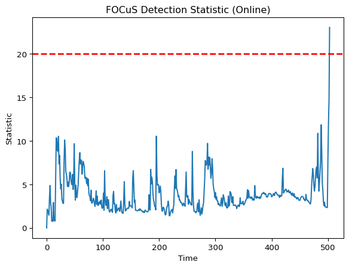
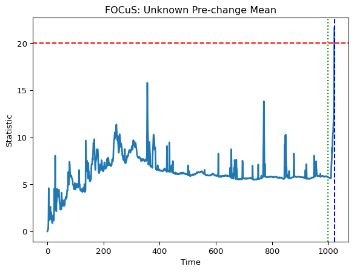
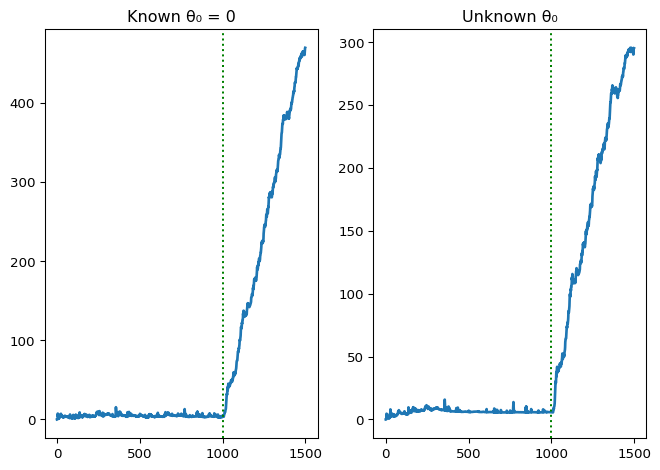
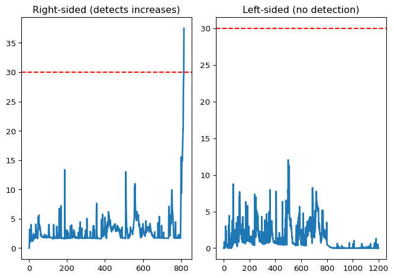
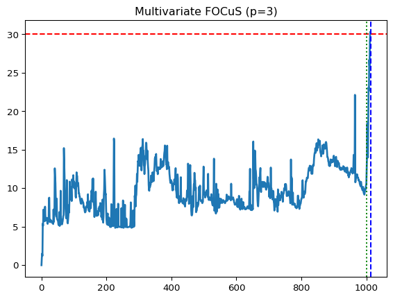
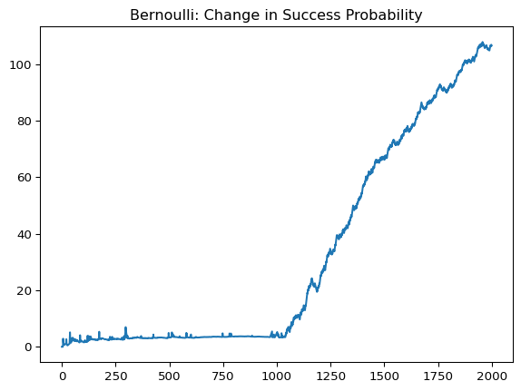
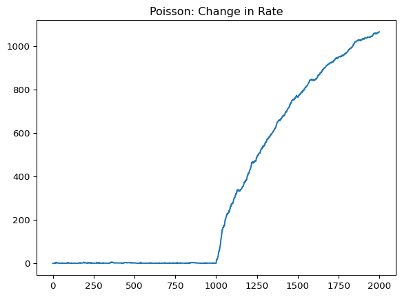
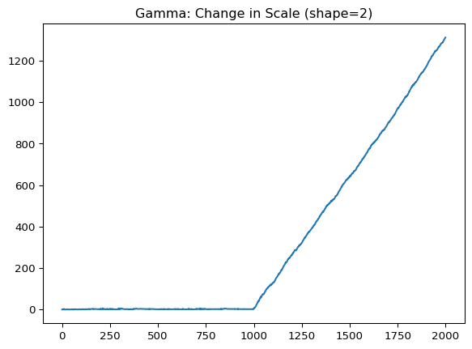
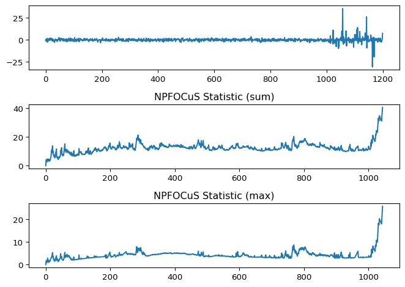

# focus_py


- [Features](#features)
- [Installation](#installation)
- [Quick Start: Offline vs Online
  Usage](#quick-start-offline-vs-online-usage)
  - [Offline Mode (`focus_offline`)](#offline-mode-focus_offline)
  - [Online Mode (Sequential Updates)](#online-mode-sequential-updates)
- [Available Functions](#available-functions)
  - [Offline Mode Interface](#offline-mode-interface)
  - [Online/Sequential Interface](#onlinesequential-interface)
- [Notes](#notes)
- [Examples](#examples)
  - [Gaussian Univariate Detection](#gaussian-univariate-detection)
  - [One-sided Detection](#one-sided-detection)
  - [Multivariate Gaussian Detection](#multivariate-gaussian-detection)
  - [Bernoulli Example](#bernoulli-example)
  - [Poisson Example](#poisson-example)
  - [Gamma Example](#gamma-example)
  - [Non-parametric Detection
    (NPFOCuS)](#non-parametric-detection-npfocus)
- [Performance Comparison](#performance-comparison)
- [References](#references)
- [Authors and Contributors](#authors-and-contributors)
- [License](#license)
  - [External libraries](#external-libraries)

``` python
import numpy as np
import matplotlib.pyplot as plt
from focus_py import focus_offline, Detector
```

**focus_py** is a high-performance Python package for online changepoint
detection in univariate and multivariate data streams. It provides
efficient C++ implementations of the **FOCuS** and **md-FOCuS**
algorithms with Python bindings for real-time monitoring and offline
analysis.

## Features

- **Multiple distributions**: supports *Gaussian change-in-mean*,
  *Poisson change-in-rate*, *Gamma/Exponential change-in-scale*,
  *Bernoulli change-in-probability*, and Non-parametric detectors. New
  models and cost functions are easy to extend.
- **Univariate and multivariate** detection
- **Known or unknown pre-change parameters**
- **One-sided and two-sided detection**
- **C++ backend** optimized for speed and scalability

## Installation

You can install the development version of **focus** from source with:

``` bash
pip install git+https://github.com/gtromano/unified_focus.git#subdirectory=focus_py
```

Or, if you have the local source directory:

``` bash
pip install path/to/focus_py
```

------------------------------------------------------------------------

## Quick Start: Offline vs Online Usage

The Python bindings provide two complementary modes:

### Offline Mode (`focus_offline`)

All computations occur inside C++ for maximum efficiency. This mode is
ideal for benchmarking, batch processing, and full statistic
trajectories.

**Key behaviors:**

- Stops immediately when the threshold is exceeded.
- Use `threshold=np.inf` to compute statistics for all samples (useful
  for visualization).

``` python
np.random.seed(123)
Y = np.concatenate([np.random.normal(0, 1, 500), np.random.normal(2, 1, 500)])

# Offline detection (entirely in C++)
res = focus_offline(Y, threshold=20, type="univariate", family="gaussian")

plt.plot(res["stat"], lw=2)
plt.title("FOCuS Detection Statistic (Offline)")
plt.xlabel("Time")
plt.ylabel("Statistic")
plt.axhline(res["threshold"], color="red", linestyle="--", lw=2)
plt.show()
```


------------------------------------------------------------------------

### Online Mode (Sequential Updates)

The online implementation allows step-by-step updates in Python. It’s
slower (each update crosses the Python–C++ boundary) but supports
real-time or adaptive control.

``` python
# Create detector
detector = Detector(type='univariate')

# Update sequentially
stat_trace = []
threshold = 20.0

for i, y in enumerate(Y, start=1):
    detector.update(y)
    result = detector.get_statistics(family='gaussian')
    stat_trace.append(result['stat'])

    if result['stat'] > threshold:
        print("Detection at time", i, "with changepoint estimate τ =", result['changepoint'])
        break

# Plot results
plt.plot(stat_trace)
plt.title("FOCuS Detection Statistic (Online)")
plt.xlabel("Time")
plt.ylabel("Statistic")
plt.axhline(threshold, color="red", linestyle="--", linewidth=2)
plt.show()
```

    Detection at time 504 with changepoint estimate τ = 500



Both modes yield the same statistical results. The offline mode is
typically **tens to hundreds of times faster**.

------------------------------------------------------------------------

## Available Functions

### Offline Mode Interface

- **`focus_offline(Y, threshold, type, family, ...)`**  
  Run the FOCuS detector in batch/offline mode with all cycles handled
  in C++ for maximum efficiency. Stops at detection by default; use
  `threshold = np.inf` to compute statistics for all observations.
  - `Y`: Observation data (1D array or 2D array)
  - `threshold`: Detection threshold(s). Can be:
    - Scalar: Single threshold applied to all statistics
    - Vector: (In case of multiple values returned per statistics, see
      Notes below)
  - `type`: One of `"univariate"`, `"univariate_one_sided"`,
    `"multivariate"`, or `"npfocus"`
  - `family`: Distribution family - `"gaussian"`, `"poisson"`,
    `"bernoulli"`, `"gamma"`, or `"npfocus"`
  - `theta0`: (Optional) Baseline parameter vector for cost computation
  - `shape`: (Optional) Shape parameter for `family = "gamma"` (required
    for gamma)
  - `dim_indexes`: (Optional) List of dimension index vectors for
    multivariate projections
  - `quantiles`: (Optional) Quantile vector for `type = "npfocus"`
  - `pruning_mult`, `pruning_offset`: Pruning parameters (default: 2, 1)
  - `side`: Pruning side - `"right"` or `"left"` (default: `"right"`)
  - Returns: dict-like object with `stat` (2D numpy array where each row
    is a time and each column is a statistic), `changepoint`,
    `detection_time`, `detected_changepoint`, `candidates`, `threshold`,
    `n`, `type`, `family`, and `shape` (if gamma)

### Online/Sequential Interface

- **`Detector(type, ...)`**  
  Create a new online detector object. Returns a Detector instance.

  - `type`: One of `"univariate"`, `"univariate_one_sided"`,
    `"multivariate"`, or `"npfocus"`
  - `dim_indexes`: (Optional) List of dimension index vectors for
    multivariate projections
  - `quantiles`: (Optional) Quantile vector for `type = "npfocus"`
  - `pruning_mult`, `pruning_offset`: Pruning parameters (default: 2, 1)
  - `side`: Pruning side - `"right"` or `"left"` (default: `"right"`)

- **`Detector.update(y)`**  
  Update the detector with a new observation vector `y`.

  - `y`: scalar (univariate) or 1D numpy array (multivariate)

- **`Detector.get_statistics(family, theta0=None, shape=None)`**  
  Compute changepoint statistics for the current state. Returns a
  dict-like result with keys `stopping_time`, `changepoint`, and `stat`.

- **Inspection helpers**:

  - `Detector.get_n_candidates()` - Get number of candidate segments
  - `Detector.get_n()` - Get number of observations processed
  - `Detector.get_sn()` - Get cumulative sum state
  - `Detector.get_candidates()` - Get all candidate changepoints as a
    dict-like object

## Notes

- **Multiple Statistics**: Some detectors (e.g., `family = "npfocus"`)
  return multiple statistics. In `focus_offline()`, the `stat` return
  value is a 2D array where each row corresponds to a time point and
  each column corresponds to a statistic.
  - For single-statistic families, the matrix has one column (use
    `res['stat'].flatten()` when needed)
  - For multi-statistic families, use vectorized thresholds or a single
    threshold (with warning)
- **Gamma Family**: When using `family = "gamma"`, you must provide a
  positive `shape` parameter. The gamma cost function assumes this shape
  is known.

## Examples

### Gaussian Univariate Detection

#### Unknown Pre-change Mean

``` python
np.random.seed(45)
Y = np.concatenate([np.random.normal(0, 1, 1000), np.random.normal(-1, 1, 500)])

res = focus_offline(Y, threshold=20, type="univariate", family="gaussian")
print("Detection time:", res["detection_time"])
print("Estimated changepoint:", res["detected_changepoint"])

plt.plot(res["stat"], lw=2)
plt.title("FOCuS: Unknown Pre-change Mean")
plt.xlabel("Time")
plt.ylabel("Statistic")
plt.axhline(res["threshold"], color="red", linestyle="--")
plt.axvline(res["detection_time"], color="blue", linestyle="--")
plt.axvline(1000, color="green", linestyle=":")
plt.show()
```

    Detection time: 1023
    Estimated changepoint: 1008



#### Known Pre-change Mean

``` python
np.random.seed(45)
theta0 = 0
Y = np.concatenate([np.random.normal(theta0, 1, 1000),
                    np.random.normal(theta0 - 1, 1, 500)])

res_known = focus_offline(Y, threshold=np.inf, type="univariate",
                                family="gaussian", theta0=theta0)
res_unknown = focus_offline(Y, threshold=np.inf, type="univariate",
                                  family="gaussian")

plt.subplot(1, 2, 1)
plt.plot(res_known["stat"], lw=2)
plt.title("Known θ₀ = 0")
plt.axvline(1000, color="green", linestyle=":")

plt.subplot(1, 2, 2)
plt.plot(res_unknown["stat"], lw=2)
plt.title("Unknown θ₀")
plt.axvline(1000, color="green", linestyle=":")
plt.tight_layout()
plt.show()
```



------------------------------------------------------------------------

### One-sided Detection

``` python
np.random.seed(789)
Y = np.concatenate([np.random.normal(0, 1, 800),
                    np.random.normal(1.5, 1, 400)])

res_right = focus_offline(Y, threshold=30,
                                type="univariate_one_sided",
                                family="gaussian", side="right")
res_left = focus_offline(Y, threshold=30,
                               type="univariate_one_sided",
                               family="gaussian", side="left")

print("Right-sided detection:", res_right["detection_time"])
print("Left-sided detection:", res_left["detection_time"])

plt.subplot(1, 2, 1)
plt.plot(res_right["stat"], lw=2)
plt.axhline(30, color="red", linestyle="--")
plt.title("Right-sided (detects increases)")

plt.subplot(1, 2, 2)
plt.plot(res_left["stat"], lw=2)
plt.axhline(30, color="red", linestyle="--")
plt.title("Left-sided (no detection)")
plt.tight_layout()
plt.show()
```

    Right-sided detection: 817
    Left-sided detection: None



------------------------------------------------------------------------

### Multivariate Gaussian Detection

``` python
np.random.seed(42)
n, p = 1500, 3
Y1 = np.random.normal(0, 1, (1000, p))
Y2 = np.random.normal(1.2, 1, (500, p))
Y = np.vstack([Y1, Y2])

res_multi = focus_offline(Y, threshold=30,
                                type="multivariate", family="gaussian")

print("Detection time:", res_multi["detection_time"])
print("Estimated changepoint:", res_multi["detected_changepoint"])

plt.plot(res_multi["stat"], lw=2)
plt.axhline(res_multi["threshold"], color="red", linestyle="--")
plt.axvline(res_multi["detection_time"], color="blue", linestyle="--")
plt.axvline(1000, color="green", linestyle=":")
plt.title("Multivariate FOCuS (p=3)")
plt.show()
```

    Detection time: 1013
    Estimated changepoint: 1001



------------------------------------------------------------------------

### Bernoulli Example

``` python
np.random.seed(123)
n = 2000
Y = np.concatenate([
    np.random.binomial(1, 0.2, n//2),
    np.random.binomial(1, 0.5, n//2)
])
res = focus_offline(Y, threshold=np.inf, type="univariate", family="bernoulli")
plt.plot(res["stat"])
plt.title("Bernoulli: Change in Success Probability")
plt.show()
```



------------------------------------------------------------------------

### Poisson Example

``` python
np.random.seed(101)
n = 2000
Y = np.concatenate([
    np.random.poisson(2, n//2),
    np.random.poisson(6, n//2)
])
res = focus_offline(Y, threshold=np.inf, type="univariate", family="poisson")
plt.plot(res["stat"])
plt.title("Poisson: Change in Rate")
plt.show()
```



------------------------------------------------------------------------

### Gamma Example

``` python
np.random.seed(124)
n = 2000
Y = np.concatenate([
    np.random.gamma(2, 2, n//2),
    np.random.gamma(2, 0.5, n//2)
])
res = focus_offline(Y, threshold=np.inf, type="univariate",
                          family="gamma", shape=2, theta0=2)
plt.plot(res["stat"])
plt.title("Gamma: Change in Scale (shape=2)")
plt.show()
```



------------------------------------------------------------------------

### Non-parametric Detection (NPFOCuS)

``` python
np.random.seed(123)
Y = np.concatenate([np.random.normal(0, 1, 1000),
                    np.random.standard_cauchy(200)])
quants = np.quantile(np.random.normal(size=10000), np.linspace(0.01, 0.99, 5))

res = focus_offline(Y=Y, threshold=[80, 25],
                          type="npfocus", family="npfocus",
                          quantiles=quants)

plt.subplot(3, 1, 1)
plt.plot(Y)
plt.subplot(3, 1, 2)
plt.plot(res["stat"][:, 0])
plt.title("NPFOCuS Statistic (sum)")
plt.subplot(3, 1, 3)
plt.plot(res["stat"][:, 1])
plt.title("NPFOCuS Statistic (max)")
plt.tight_layout()
plt.show()
```



------------------------------------------------------------------------

## Performance Comparison

``` python
np.random.seed(999)
n = 100_000
Y = np.concatenate([np.random.normal(0, 1, n//2),
                    np.random.normal(1, 1, n//2)])

import time
t0 = time.time()
res_offline = focus_offline(Y, threshold=np.inf, type="univariate", family="gaussian")
offline_time = time.time() - t0

t1 = time.time()
det = Detector(type="univariate")
stat_online = []
for y in Y:
    det.update(y)
    stat_online.append(det.get_statistics(family='gaussian')["stat"])
online_time = time.time() - t1

print(f"Offline time: {offline_time:.2f}s")
print(f"Online time:  {online_time:.2f}s")
print(f"Offline is {online_time / offline_time:.1f}× faster")
```

    Offline time: 0.21s
    Online time:  0.36s
    Offline is 1.8× faster

------------------------------------------------------------------------

## References

<div id="ref-pishchagina2023online" class="csl-entry">

Pishchagina, Liudmila, Gaetano Romano, Paul Fearnhead, Vincent Runge,
and Guillem Rigaill. 2025. “Online Multivariate Changepoint Detection:
Leveraging Links with Computational Geometry.” *Journal of the Royal
Statistical Society Series B: Statistical Methodology*: qkaf046.
<https://doi.org/10.1093/jrsssb/qkaf046>

</div>

<div id="ref-romano2024" class="csl-entry">

Romano, Gaetano, Idris A. Eckley, and Paul Fearnhead. 2024. “A
Log-Linear Nonparametric Online Changepoint Detection Algorithm Based on
Functional Pruning.” *IEEE Transactions on Signal Processing* 72:
594–606. <https://doi.org/10.1109/tsp.2023.3343550>.

</div>

<div id="ref-romano2023fast" class="csl-entry">

Romano, Gaetano, Idris A Eckley, Paul Fearnhead, and Guillem Rigaill.
2023. “Fast Online Changepoint Detection via Functional Pruning CUSUM
Statistics.” *Journal of Machine Learning Research* 24 (81): 1–36.
<https://www.jmlr.org/papers/v24/21-1230.html>.

</div>

<div id="ref-ward2024constant" class="csl-entry">

Ward, Kes, Gaetano Romano, Idris Eckley, and Paul Fearnhead. 2024. “A
Constant-Per-Iteration Likelihood Ratio Test for Online Changepoint
Detection for Exponential Family Models.” *Statistics and Computing* 34
(3): 1–11.

</div>

</div>

## Authors and Contributors

- Gaetano Romano: [email](mailto:g.romano@lancaster.ac.uk) (**Author**)
  (**Maintainer**) (**Creator**) (**Translator**)

- Kes Ward: [email](mailto:k.ward4@lancaster.ac.uk) (**Author**)

- Liudmila Pishchagina:
  [email](mailto:liudmila.pishchagina@univ-evry.fr) (**Author**)

- Guillem Rigaill: [email](mailto:guillem.rigaill@inrae.fr) (**Author**)
  (**Thesis Advisor**)

- Vincent Runge: [email](mailto:vincent.runge@univ-evry.fr) (**Author**)
  (**Thesis Advisor**)

- Paul Fearnhead: [email](mailto:p.fearnhead@lancaster.ac.uk)
  (**Author**) (**Thesis Advisor**)

- Idris A. Eckley: [email](mailto:i.eckley@lancaster.ac.uk) (**Author**)
  (**Thesis Advisor**)

## License

This package is provided under the MIT License.

### External libraries

The Python package depends on the Qhull library (http://www.qhull.org/),
from C.B. Barber and The Geometry Center. If the library is not found,
the user will be notified with instructions to install.
